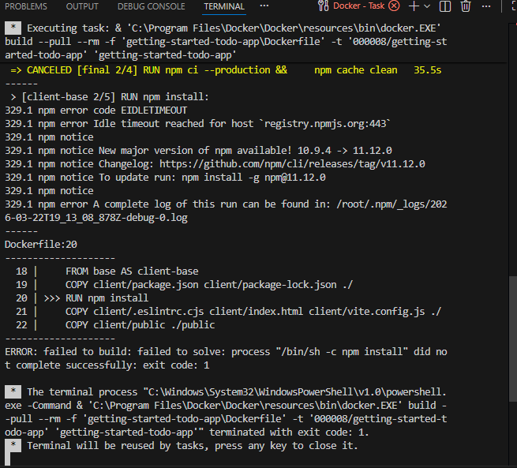

## Build and Push Your First Image

1. Sign in to hub.docker.com
2. Create a repository called `getting-started-todo-app` in Docker Hub
3. Login to Docker Desktop using your Docker credentials
4. Install Docker extension on VS Code
5. Clone the repo in VS Code terminal:  
   `git clone https://github.com/docker/getting-started-todo-app`
6. Note: cloning won't work if you don’t have git installed on your system. 
7. Right-click the `Dockerfile` in the cloned folder and select **Build Image…**
8. In the dialog, enter image name: `000008/getting-started-todo-app` (000008 = your Docker username)
9. I got this error: **npm error**. 
10. I reran the build in a new terminal. Then it worked. Notice: `000008/getting-started-todo-app:latest`
11. Tried to push: `docker push 000008/getting-started-todo-app-latest`
12. I noticed the image was in Docker Desktop but not on my Docker Hub registry
13. Ran `docker pull` to check → error showed the image wasn’t pushed to Docker Hub
14. Confirmed locally with `docker image` (or `docker images`) → my image was available locally
15. Reran `docker push`, now it is visible on Docker Hub. It appears there was a network error during the previous push attempt.
